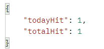
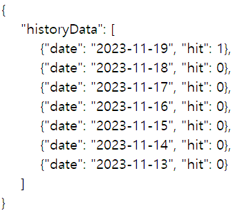
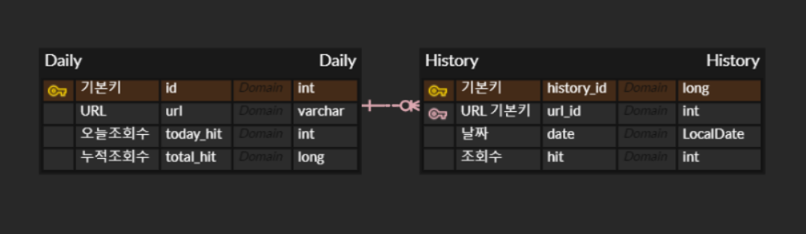
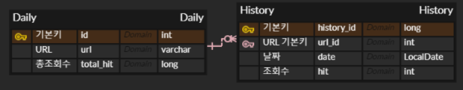
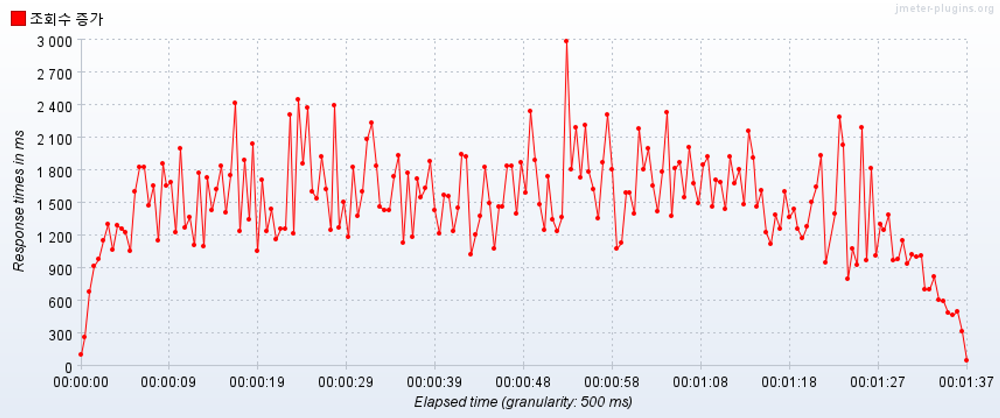
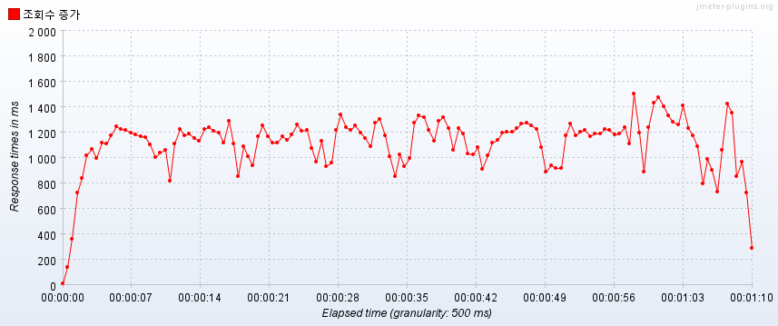

본 레파지토리는 넘블 딥 다이브 프로젝트인 "방문자 수 트래킹 서비스 구축하기"의 결과물입니다.

## 프로젝트 소개
본 프로젝트는 url의 조회수를 관리하는 기능을 제공합니다.
1. url 정보를 등록하고 조회수를 증가시킬 수 있습니다.
2. url의 일일 조회수와 총 조회수를 조회할 수 있습니다.
3. url의 7일간의 조회수를 조회할 수 있습니다.

## 구현 기능
API 명세서:  http://localhost:8080/swagger-ui/index.html   
다음 4 가지의 기능을 제공합니다.   
|기능|전송|반환|
|---|:---:|---|
|url 조회수 증가|PUT http://{domain}/hit?url={url}||
|url 조회수 조회|GET http://{domain}/hit?url={url}||
|url 히스토리 조회|GET http://{domain}/history?url={url}||
|오늘 조회수 업데이트| 자정마다 실행| 자정마다 현재 오늘의 조회수를 히스토리에 저장하고 오늘의 조회수를 0으로 변경|

## 개발기간
v1 2023/10/05 ~ 2023/10/18 (2주)  [바로가기](https://github.com/mii2026/Numble-Project/tree/v1)   
v2 2023/11/13 ~ 2023/11/19        [바로가기](https://github.com/mii2026/Numble-Project/tree/v2)   
v3 2024/04/01 ~ 2024/04/08

## 기술 스택
- Back-end   
: Java, Spring, JPA, Mysql, Swagger
- 버전 관리   
: Git, Github actions(CI)

## Branch 관리
Github Actions를 이용하여 main branch에 pull request가 들어오면 프로그램을 자동으로 테스트와 빌드합니다. ([코드](https://github.com/mii2026/Numble-Project/blob/v1/.github/workflows/ci.yml))
- main branch: 구현이 완료된 사항을 합하는 용도
- develop branch: 구현 중인 사항을 저장하는 용도

## 프로젝트 구성도
| ERD (v1, v2) |
| :---: |
||

| ERD (v3) |
| :---: |
||

## 트러블 슈팅
1. (v1) 대용량 데이터 처리 성능 향상 
    - 오늘 조회수 업데이트 기능에서 자정마다 모든 당일 조회수를 history에 저장하고 0으로 변경하는 대용량 업데이트를 진행
    - jpa의 updateAll 함수를 jdbctemplete batch update로 변경하여 문제 해결
    -  10,000개의 데이터에 대한 대용량 업데이트의 실행시간을 **24초에서 2.541초**로 단축

#

2. (v1) 조회수 증가 요청의 동시성 문제 개선
    - 조회수 증가 요청 시 동시성 문제가 발생
    - Redis의 Redisson을 이용하여 url별로 분산락을 구성

#

3. (v2) 트래픽 증가 시 조회수 증가 요청의 지연 문제 개선
   
    **문제**   
    - Redis Redisson의 분산락을 사용한 경우 높은 트래픽에서 조회수 증가 요청의 지연이 발생함
    
    **해결 과정**
    - 락을 사용하여 기다리는 시간이 들어 지연이 발생하므로 락을 없애고자 함
    - 기존 방식   
      : url의 조회수 값을 받아옴 -> 조회수 값이 없다면 조회수 0인 데이터 생성 / 조회수 값이 있다면 백엔드에서 1을 더해 업데이트
    - 백엔드에서 조회수를 계산해 증가요청을 보내기에 락이 필요한 것이므로 계산을 MySQL에서 진행하도록 하여 락을 제거
  
   **해결 방안**
    - url 조회수의 여부 확인   
      -> 없다면 upsert로 조회수 0인 데이터 생성(중복 생성 방지) / 있다면 update set todayHit=todayHit+1로 DB에서 업데이트
  
   **결과**
   - jmeter로 1초 내에 100개의 전송을 60회 보내는 테스트 진행
   - 평균 응답 속도를 **1494ms에서 1118ms**로 개선함
        
     |변경 전|
     |---|
     ||
     |변경 후|
     ||

#

3. (v3) 트래픽 증가 시 조회수 증가 요청의 지연 문제 개선
    
    **문제**   
    - v2 방식에서도 높은 트래픽에서 조회수 증가 요청의 지연이 발생함

    **해결 과정**
    - 일일 조회수를 redis에서 관리하도록 하여 속도를 높이고 동시성 문제도 해결
    - 총 조회수와 조회수 이전 기록 경우 안전성이 더 보장된 MySQL에서 저장

    **결과**
   - jmeter로 1초 내에 100개의 전송을 60회 보내는 테스트 진행
   - 평균 응답 속도가 100ms 이하로 개선함

## 회고록
version 1
1. [API 프로토타입 만들기](https://lateral-stag-283.notion.site/1-API-98ae9eedfc6a43b8a3929ab3f9a617c4?pvs=4)
    - ERD 그리기 및 요구사항 정의
    - 프로토타입 작성
    - 단위 테스트 코드 작성 (테스트 DB 분리, 테스트 전 DB 초기화)
2. [Swagger 사용하기 & CI 적용하기](https://lateral-stag-283.notion.site/2-Swagger-CI-b8e141ab27864fc09427e253b1cd7eee?pvs=4)
    - Swagger 적용하기
    - 통합 테스트 코드 작성, Github Actions를 이용한 CI 적용
3. [대용량 데이터 처리와 동시성 문제 처리](https://lateral-stag-283.notion.site/3-47b84c86eafb4299a2a357a209d9308c?pvs=4)
    - 대용량 처리 성능 향상(paging + jdbctemplete)
    - 조회수 증가 동시성 문제 해결(Redis redisson)

version 2   
- [대용량 트래픽에서 성능 개선하기](https://lateral-stag-283.notion.site/4-4740025d3f0d4731a490a42d4e59635f?pvs=4)   
  - 조회수 증가 성능 개선(Mysql update/upsert native query)
      
